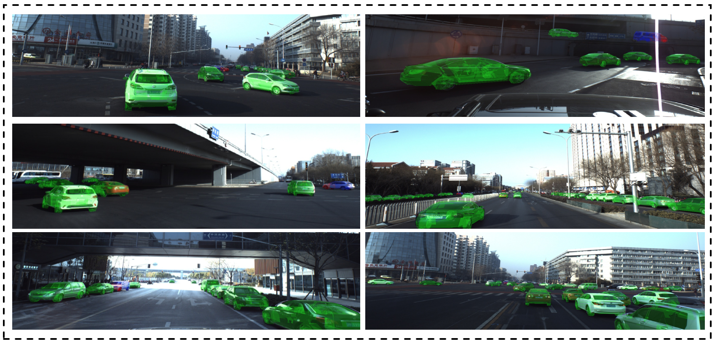
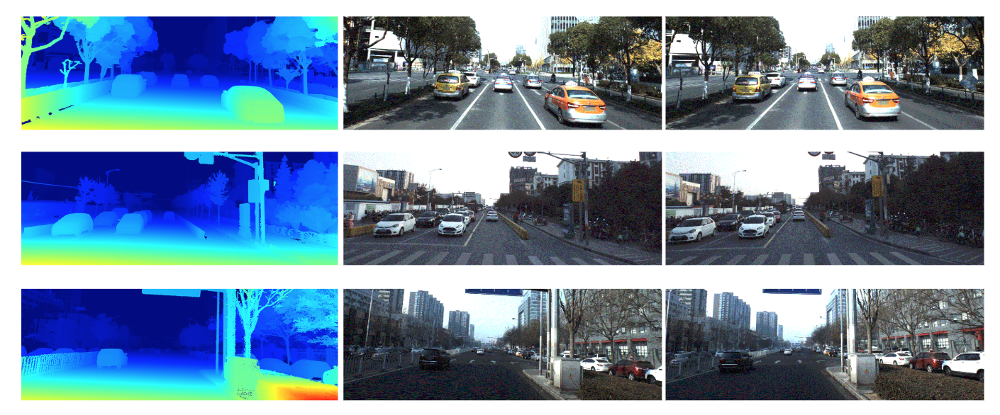

# Toolkit for ApolloScape Dataset 

## Introduction
This is a repo of toolkit for dataset of [ApolloScape ECCV challenge](http://apolloscape.auto/ECCV/index.html) and [ApolloScape CVPR 2019 Workshop on Autonomous Driving Challenge](http://wad.ai/). It includes lanemark segmentation, online self-localization, 3D car instance understanding, Trajectory Prediction, 3D Lidar Object Detection and 3D Lidar Object Tracking and Stereo. Some example videos and images are shown below:

### Lanemark segmentation:


### Online self-localization:


### 3D car instance understanding:


### Trajectory Prediction:


### 3D Lidar Object Detection and Tracking:


### Stereo estimation:


Run 
```bash
pip install -r requirements.txt
source source.rc
```
to include necessary packages and current path in to PYTHONPATH to use several util functions.

Please goto each subfolder for detailed information about the data structure, evaluation criterias and some demo code to visualize the dataset.


## Contact

Please feel free to contact us and raise issues with any questions, suggestions or comments:
* apollo-scape@baidu.com
